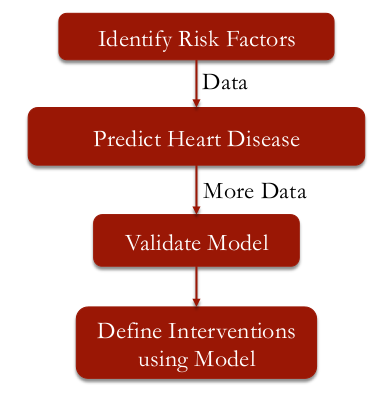

```{r setup, cache = FALSE, echo = FALSE, message = FALSE, warning = FALSE, tidy = FALSE}
require(knitr)
options(width = 160, scipen = 5)
# options(width = 100, digits = 7)
opts_chunk$set(message = FALSE, error = FALSE, warning = FALSE, 
               collapse = TRUE, tidy = FALSE,
               cache = TRUE, cache.path = '.cache/', 
               fig.align = 'left', dpi = 100, fig.path = './figures/Framingham/')
# opts_chunk$set(dev="png", 
#                dev.args=list(type="cairo"),
#                dpi=96)
```

## PRELIMINARIES

Libraries needed for data processing and plotting:
```{r load_packages, cache = FALSE, echo = TRUE, message = FALSE, warning = FALSE, tidy = FALSE}
library("dplyr")
library("magrittr")
library("ggplot2")

library("caTools")
library("ROCR")
```


## ABOUT THE DATA

In this practice exercise we will predict 10-year risk of Coronary Heart Disease (CHD). 

We will investigate risk factors collected in the first data collection for the study, using an
anonymized version of original data.
  
* Demographic risk factors
    * __male__: sex of patient
    * __age__: age in years at first examination
    * __education__: Some high school (1), high school/GED (2), college/vocational school (3), college (4)

* Behavioral risk factors
    * __currentSmoker__, __cigsPerDay__: Smoking behavior

* Medical history risk factors
    * __BPmeds__: On blood pressure medication at time of first examination
    * __prevalentStroke__: Previously had a stroke
    * __prevalentHyp__: Currently hypertensive
    * __diabetes__: Currently has diabetes

* Risk factors from first examination
    * __totChol__: Total cholesterol (mg/dL)
    * __sysBP__: Systolic blood pressure
    * __diaBP__: Diastolic blood pressure
    * __BMI__: Body Mass Index, weight (kg)/height (m) 2
    * __heartRate__: Heart rate (beats/minute)
    * __glucose__: Blood glucose level (mg/dL)

## The Analytical Approach




## LOADING THE DATA

Read the dataset `framingham`.
```{r load_data}
framingham <- read.csv("data/framingham.csv")

str(framingham)
```

###  Split the data into training and testing sets

When you have more data like we do here, you can afford to put less data in the training set and
more in the testing set.   
This will increase our confidence in the ability of the model to extend to new data since we have
a larger test set, and still give us enough data in the training set to create our model.
You typically want to put somewhere between 50% and 80% of the data in the training set.

```{r split_data}
set.seed(1000)
split <- sample.split(framingham$TenYearCHD, SplitRatio = 0.65)

train <- subset(framingham, split == TRUE)
test <- subset(framingham, split == FALSE)
```

## Logistic Regression Model

For this model, we will fit `TenYearCHD` using all other variables in the data set as independent variables.   
Note the `~ .` syntax "trick".

```{r logRegr_model}
framinghamLog <- glm(TenYearCHD ~ ., data = train, family = binomial)

summary(framinghamLog)
```

* It looks like __male__, __age__, __prevalent stroke__, __total cholesterol__, __systolic blood pressure__, and __glucose__ are all significant in our model.
* __Cigarettes per day__ and __prevalent hypertension__ are almost significant.

All of the significant variables have __positive coefficients__, meaning that higher values in these
variables contribute to a higher probability of 10-year coronary heart disease.


### Predictions on the test set

```{r predict_on_test}
predictTest <- predict(framinghamLog, type = "response", newdata = test)
```

Now, let's use a __threshold__ value of __0.5__ to create a _confusion matrix_.

```{r OoS_confusion_matrix}
tmp <- table(test$TenYearCHD, predictTest > 0.5)

tmp
```

We'll use the table function and give as the first argument, the actual values, `test$TenYearCHD`,
and then as the second argument our predictions, `predictTest > 0.5`.   
With a threshold of 0.5, we predict an outcome of 1, the true column, very rarely 
(__`r round(100*sum(tmp[,2])/sum(tmp), 1)`%__ of the times).

__This means that our model rarely predicts a 10-year CHD risk above 50%__.

### What is the accuracy of this model?

Overall accuracy is the sum of the _cases we get right_, __`r tmp[1,1]+tmp[2,2]`__ divided by the
_total number_ of observations in our data set, _i.e._ __`r sum(tmp)`__.
So the accuracy of our model is about __`r round(100*(tmp[1,1]+tmp[2,2])/sum(tmp),1)`%__.

We need to compare this to the accuracy of a simple _baseline method_.   
The more frequent outcome in this case is 0, so the _baseline method would always predict 0_ or _no CHD_.   
This baseline method would get an accuracy of __`r sum(tmp[1,])`__ ,the total number of true negative cases, 
divided by the total number of observations in our data set, __`r sum(tmp)`__.
So the baseline model would get an accuracy of about __`r round(100*sum(tmp[1,])/sum(tmp),1)`%__.

So our model barely beats the baseline in terms of accuracy!!

But do we still have a valuable model by varying the threshold?

### Test set AUC 

```{r AUC}
ROCRpred <- prediction(predictTest, test$TenYearCHD)
AUC.test <- as.numeric(performance(ROCRpred, "auc")@y.values)
```

The __AUC__ _Out Of Sample_ is then __`r round(AUC.test, 3)`__, which means that the model can
differentiate between low risk patients and high risk patients pretty well.


## Summary of Model Strength

We were able to build a logistic regression model with a few interesting properties.

* It rarely predicted 10-year CHD risk above 50%.
    * So the accuracy of the model was very close to the baseline model.

* However, the model could differentiate between low risk patients and high risk patients pretty
  well with an out-of-sample AUC of `r AUC.test`.

* Additionally, some of the significant variables suggest possible interventions to prevent CHD.
    * We saw that more cigarettes per day, higher cholesterol, higher systolic blood pressure, and
      higher glucose levels all increased risk.


## VALIDATING THE MODEL

So far, we have used what is known as _internal validation_ to test our model.
This means that we took the data from one set of patients and split them into a training set and a testing set.
While this confirms that our model is good at making predictions for patients in the Framingham
Heart Study population, it is _unclear if the model generalizes to other populations_.

The Framingham cohort of patients were white, middle class adults.

To be sure that the model extends to other types of patients, we need to test on other
populations.  
This is known as _external validation_.


