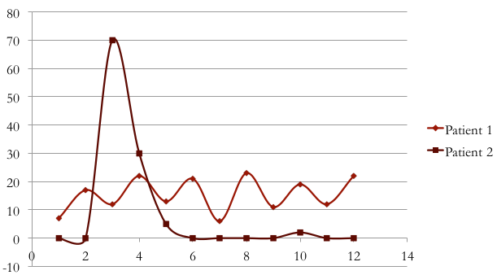
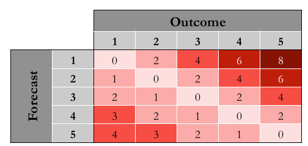
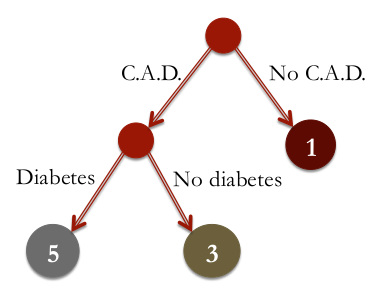
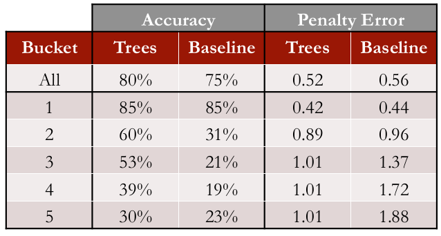

```{r setup, cache = FALSE, echo = FALSE, message = FALSE, warning = FALSE, tidy = FALSE}
require(knitr)
options(width = 160, scipen = 5)
# options(width = 100, digits = 7)
opts_chunk$set(message = FALSE, error = FALSE, warning = FALSE, 
               collapse = TRUE, tidy = FALSE,
               cache = FALSE, cache.path = '.cache/', 
               fig.align = 'left', dpi = 100, fig.path = 'figures/Health_Care_Costs/')
# opts_chunk$set(dev="png", 
#                dev.args=list(type="cairo"),
#                dpi=96)
```

## PRELIMINARIES

Libraries needed for data processing and plotting:
```{r load_packages, cache = FALSE, echo = TRUE, message = FALSE, warning = FALSE, tidy = FALSE}
library("dplyr")
library("magrittr")
library("ggplot2")

library("caTools")
library("rpart")
library("rpart.plot")
library("ROCR")
library("randomForest")
library("caret")
library("e1071")
```

## INTRODUCTION

The specific exercise we are going to see in this lecture is an analytics approach to building
models starting with 2.4 million people over a three year span, the period between 2001 and 2003.

We make out-of-sample predictions for the period of 2003 and 2004.

This was in the early years of D2Hawkeye.
Out of the 2.4 million people, we included only people with data for at least 10 months in both
periods, both in the observation period and the results period.
This decreased the data to 400,000 people.


### The D2 Hawkeye data

To build an analytics model, let us discuss the variables we used.

* 13,000 diagnoses.  It's for the codes for diagnosis that claims data utilize.
* 22,000 different codes for procedures
* 45,000 codes for prescription drugs.

To work with this massive amount of variables, we aggregated the variables as follows.

* Out of the 13,000 diagnoses, we defined __217 diagnosis groups__.
* Out of the 20,000 procedures, we aggregated the data to develop __213 procedure groups__.
* Finally, from 45,000 prescription drugs, we developed __189 therapeutic groups__.


To illustrate an example of how we infer further information from the data, the graph here shows
on the horizontal axis, time, and on the vertical axis, costs in thousands of dollars.



* Patient one is a patient who, on a monthly basis, has costs on the order of \$10,000 to
\$15,000, a fairly significant cost but fairly constant in time.

* Patient two has also an annual cost of a similar size to patient one.
But in all but the third month, the costs are almost \$0. Whereas in the third month, it cost about \$70,000.

In fact, this is additional data we defined indicating whether the patient has a _chronic_ or an _acute_ condition.

In addition to the initial variables we also defined in collaboration with medical doctors, __269 medically-defined rules__.

For example, 

* Interaction between various illnesses (_e.g._, obesity and depression).
* Interaction between diagnosis and age (_e.g._, more than 65 years old and coronary artery disease).
* Noncompliance with treatment (_e.g._, non-fulfillment of a particular drug order).
* Illness severity (_e.g._, severe depression as opposed to regular depression).

There is another set of variables involving __demographic information__, such as gender and age.

An important aspect of the variables are the variables related to cost.
Rather than using costs directly, we bucketed costs and considered everyone in the group equally.
We defined __five buckets__ partitioned in such a way that each accounted for _20% of the total cost_.

The partitions were:

* from 0 to 3,000, 
* from 3,000 to 8,000,
* from 8,000 to 19,000,
* from 19,000 to 55,000, and
* above 55,000.

The number of patients that were below 3,000 was 78% of the patients.

### Interpretation of the _cost buckets_

This diagram shows the various levels of risk.


* Bucket one consists of patients that have rather low risk.
* Bucket two has what is called emerging risk.
* In bucket three, moderate level of risk.
* Bucket four, high risk.
* And bucket five, very high risk.

From a medical perspective,

* buckets two and three, the medical and the moderate risk patients, are candidates for _wellness programs_.
* Whereas bucket four, the high risk patients, are candidates for _disease management programs_.
* bucket five, the very high risk patients, are candidates for _case management_.


### Error Measures

Let us introduce the error measures we used in building the analytics models.

Of course $R^2$ was used, but it was accompanied by other measures.

The so-called __"penalty error"__ is motivated by the fact that if you classify a very high-risk
patient as a low-risk patient, this is more costly than the reverse, namely classifying a low-risk
patient as a very high-risk patient.

Motivated by this, we developed a penalty error with the idea of using asymmetric penalties.
The following figure show the _penalty error_ as a matrix between outcome and (model) forecast.



For example, whenever we classify a low-risk patient as high-risk, we pay a penalty of 2, which is
a difference of 3 minus 1, the difference in the error.
However, for the reverse case, when you classify a bucket 3 patient as bucket 1 patient, the penalty is twice as much.

The off diagonal penalties are double the corresponding penalties in the lower diagonal.


### Baseline reference

To judge the quality of the analytics models we developed, we compare it with a baseline, which
is to simply predict that the __cost in the next period will be the cost in the current period__.

We have observed that as far as identification of buckets is concerned, the accuracy was 75%.    
The average penalty error of the baseline was 0.56.


### The Method: CART with multi-class classification

In this case, we use multi-class classification because the outcome to predict is the __bucket
classification__, for which there are __five classes__.

Classification trees have the __major advantage of being interpretable__ by the physicians who
observe them and judge them.
In other words, people were able to identify these cases as reasonable.  
The human intuition agreed with the output of the analytics model.


To give you an example, let us consider patients that have two types of diagnosis:
coronary artery disease (CAD) and diabetes.



* If a patient does not have a coronary artery disease, we would classify the patient as bucket one.
* If it has coronary artery disease, then we check whether the person has diabetes or does not have diabetes.
    * If it has diabetes, then it's bucket five, very high risk.
    * If it does not have diabetes, but given it has coronary artery disease, it is classified as bucket three.


In the application of Hawkeye, the most important factors in the beginning of the tree were related to cost.   
As the tree grows the secondary factor involve various chronic illnesses and some of the medical rules we discussed earlier.

For example, whether or not the patient has asthma and depression or not.
If it has asthma and depression, then it's bucket five.

#### Examples of _bucket 5_ patients

* Under 35 years old, between \$3300 and \$3900 in claims, C.A.D., but no office visits in last year

* Claims between \$3900 and \$43000 with at least \$8000 paid in last 12 months, \$4300 in
  pharmacy claims, acute cost profile and cancer diagnosis

* More than \$58000 in claims, at least \$55000 paid in last 12 months, and not an acute profile.


## LOADING THE DATA

This data comes from the [DE-SynPUF](http://www.cms.gov/Research-Statistics-Data-and-Systems/Downloadable-Public-Use-Files/SynPUFs/DE_Syn_PUF.html) dataset, 
published by the United States Centers for Medicare and Medicaid Services (CMS).    
The observations represent a 1% random sample of Medicare beneficiaries, limited to those still alive at the end of 2008.

```{r load_data, cache = TRUE}
Claims <- read.csv("data/ClaimsData.csv.gz")
```

```{r show_data}
str(Claims)

# summary(Claims)
```

### The Variables

Our independent variables are from 2008, and we will be predicting cost in 2009.
They are:

* _age_: patient's age in years at the end of 2008, 
  
and several __binary variables__ indicating whether (__1__) or not (__0__) the patient had
diagnosis codes for a particular disease or related disorder in 2008: 

* __alzheimers__, 
* __arthritis__, 
* __cancer__,
* __copd__, chronic obstructive pulmonary disease, 
* __depression__,
* __diabetes__, 
* __heart.failure__, 
* __ihd__, ischemic heart disease,
* __kidney disease__,
* __osteoporosis__,
* __stroke__.

Finally there are non-medical-diagnostic variables:

* __reimbursement2008__: the total amount of Medicare reimbursements for this patient in 2008.
* __reimbursement2009__: the total value of all Medicare reimbursements for the patient in 2009.
* __bucket2008__: the cost bucket the patient fell into in 2008,
* __bucket2009__: the cost bucket the patient fell into in 2009.

These cost buckets are defined using the thresholds determined by D2Hawkeye.

We can verify that the number of patients in each cost bucket has the same structure as what we
saw for D2Hawkeye by computing the percentage of patients in each cost bucket.

```{r check_buckets}
table(Claims$bucket2009)/nrow(Claims)

round(100.0*table(Claims$bucket2009)/nrow(Claims), 2)
```
The vast majority of patients in this data set have low cost.

```{r plot_2008_reimbursements, fig.width = 6, fig.height = 4}
hist(log10(Claims$reimbursement2008), xlab = "log10(2008 reimbursements)", ylab = "Frequency", 
     main = "Distribution of 2008 Reimbursements", col = "orange")
```

We can check the total cost by bucket:
```{r check_2008_cost_by_bucket}
tot2008 <- sum(Claims$reimbursement2008)

group_by(Claims, bucket2008) %>% summarise(cost2008 = sum(reimbursement2008), frac2008 = cost2008/tot2008)
```
The thresholds of the _D2Hawkeye_ study were designed to divide patients in 5 buckets each accounting for a similar portion 
of the total cost, _i.e._ 20%.    
The data we are going to use here do not break down as neatly, with fractions between 13% and 33%.


## A MODEL FOR HEALTHCARE COST PREDICTION

__Our goal will be to predict the cost bucket the patient fell into in 2009 using a CART model__.


###  Split the data into training and testing sets

First we split our entire data set into _training_ and _test_ sets, with 60/40 split:
```{r split_data}
set.seed(88)

spl <- sample.split(Claims$bucket2009, SplitRatio = 0.6)
ClaimsTrain <- subset(Claims, spl == TRUE)
ClaimsTest <- subset(Claims, spl == FALSE)
```


### Baseline Method and Penalty Matrix

The baseline method would predict that the cost bucket for a patient in 2009 will be the same as it was in 2008.   
So let's create a classification matrix to compute the accuracy for the baseline method on the test set.

The accuracy is the sum of the diagonal, the observations that were classified correctly, divided
by the total number of observations in our test set.

```{r baseline_accuracy}
cmat_base <- table(ClaimsTest$bucket2009, ClaimsTest$bucket2008)

cmat_base

base_accu <- sum(diag(cmat_base))/nrow(ClaimsTest)
```
The accuracy of the baseline method is the __`r round(100.0*base_accu,2)`%__.

How about the __penalty error__?

We need to first create a penalty matrix, where we will put the _actual_ outcomes on the _left_ (rows), 
and the _predicted_ outcomes on the top (columns) (__note__ that this is the transpose of the matrix shown 
in the figure above).
```{r set_penalty_matrix}
PenaltyMatrix <- matrix(c(0,1,2,3,4,2,0,1,2,3,4,2,0,1,2,6,4,2,0,1,8,6,4,2,0), byrow = TRUE, nrow = 5)

PenaltyMatrix
```

Therefore, the _penalty error_ of baseline method is:
```{r baseline_penalty_error}
as.matrix(table(ClaimsTest$bucket2009, ClaimsTest$bucket2008))*PenaltyMatrix

base_penalty_error <- sum(as.matrix(table(ClaimsTest$bucket2009, ClaimsTest$bucket2008))*PenaltyMatrix)/nrow(ClaimsTest)
```
The __penalty error__ of the baseline method is __`r round(base_penalty_error,3)`__.

Our __goal__ will be to create a _CART_ model that has an accuracy higher than __`r round(100.0*base_accu,2)`%__ 
and a penalty error lower than  __`r round(base_penalty_error,3)`__.


### A different baseline method

Suppose that instead of the baseline method just discussed, we used the baseline method of
predicting the _most frequent outcome_ for all observations, _i.e._ predict cost bucket __1__ for
everyone.

What are the accuracy and penalty error for this model?

The confusion matrix would be the following:
```{r other_baseline_cmat}
cmat_all1 <- matrix(c(rowSums(cmat_base), rep(0, 20)), byrow = FALSE, nrow = 5)

cmat_all1
```

Accuracy:
```{r other_baseline_accu}
sum(cmat_all1[,1])
accu_base_all_1 <- cmat_all1[1,1]/nrow(ClaimsTest)
```
... would be __`r round(100*accu_base_all_1, 1)`%__.

Penalty error:
```{r other_baseline_penalty}
# as.matrix(cmat_all1*PenaltyMatrix)
# sum(as.matrix(cmat_all1*PenaltyMatrix))
altbase_penalty_error <- sum(as.matrix(cmat_all1*PenaltyMatrix))/nrow(ClaimsTest)
```
... would be __`r round(altbase_penalty_error,3)`__.


### The CART model

```{r model_CART, cache = TRUE}
model_CART <- rpart(bucket2009 ~ 
                        age + alzheimers + arthritis + cancer + 
                        copd + depression + diabetes + heart.failure + 
                        ihd + kidney + osteoporosis + stroke + 
                        bucket2008 + reimbursement2008, 
                    data = ClaimsTrain, 
                    method = "class", 
                    cp = 0.00005)
```
Note that even though we have a multi-class classification problem here, we build our tree in the
same way as a binary classification problem.

__Note on `cp`__: the `cp` value we are using was selected through cross-validation on the
training set.
We are not performing the cross-validation here, because it takes a significant amount of time on
a data set of this size.
Remember that we have almost 275,000 observations in our training set.

```{r model_CART_plot, fig.width = 10, fig.height = 8}
prp(model_CART)
```
We have a huge tree here.  This makes sense for a few reasons.   
One is the large number of observations in our training set.
Another is that we have a five-class classification problem, so the classification is more complex
than a binary classification case, like the one we saw in the previous lecture.

The trees used by D2Hawkeye were also very large CART trees.
While this hurts the interpretability of the model, it is still possible to describe each of the
buckets of the tree according to the splits.


#### Out-of-Sample predictions of the _CART_ model

```{r model_CART_predict_test}
predict_CART_Test <- predict(model_CART, newdata = ClaimsTest, type = "class")
```
* We need to give `type = "class"` if we want the majority class predictions.   
  This is like using a _threshold of 0.5_.

```{r CART_baseline_accuracy}
cmat_CART <- table(ClaimsTest$bucket2009, predict_CART_Test)
cmat_CART

CART_accu <- sum(diag(cmat_CART))/nrow(ClaimsTest)
```
The accuracy of this CART model is the __`r round(100.0*CART_accu,2)`%__.

For the penalty error, we can use the penalty matrix we prepared previously.

```{r CART_penalty_error}
as.matrix(table(ClaimsTest$bucket2009, predict_CART_Test))*PenaltyMatrix

CART_penalty_error <- sum(as.matrix(table(ClaimsTest$bucket2009, predict_CART_Test))*PenaltyMatrix)/nrow(ClaimsTest)
```
The __penalty error__ of the baseline method is __`r round(CART_penalty_error,3)`__.

While we increased the accuracy, the penalty error also went up.  Why?   
By default, `rpart` will try to maximize the overall accuracy, and every type of error is seen as
having a penalty of one.    
Our CART model predicts 3, 4, and 5 so rarely because there are very few observations in these classes.   
Therefore we do not really expect this model to do better on the penalty error than the baseline method.

__How can we fix this?__

### New CART model with loss matrix

The `rpart` function allows us to _specify a parameter_ called __loss__.   
This is the penalty matrix we want to use when building our model.

If the `rpart` function knows that we will be giving a higher penalty to some types of errors over
others, it might choose different splits when building the model to minimize the worst types of
errors.
We will probably get a lower overall accuracy with this new model, but hopefully, the penalty
error will be much lower too.

```{r CART_loss_model, cache = TRUE}
model_CART_loss <- rpart(bucket2009 ~ 
                             age + alzheimers + arthritis + cancer + 
                             copd + depression + diabetes + heart.failure + 
                             ihd + kidney + osteoporosis + stroke + 
                             bucket2008 + reimbursement2008, 
                         data = ClaimsTrain, 
                         method = "class", 
                         cp = 0.00005, 
                         parms = list(loss = PenaltyMatrix))
```

#### Out-of-Sample predictions of the _CART_ model _with loss_

```{r CART_loss_predict_test}
CART_loss_predict_Test <- predict(model_CART_loss, newdata = ClaimsTest, type = "class")
```

```{r CART_loss_accuracy}
CART_loss_cmat <- table(ClaimsTest$bucket2009, CART_loss_predict_Test)
CART_loss_cmat

CART_loss_accu <- sum(diag(CART_loss_cmat))/nrow(ClaimsTest)
```
The accuracy of this CART model is the __`r round(100.0*CART_loss_accu,2)`%__.

```{r CART_loss_penalty_error}
as.matrix(table(ClaimsTest$bucket2009, CART_loss_predict_Test))*PenaltyMatrix

CART_loss_penalty_error <- sum(as.matrix(table(ClaimsTest$bucket2009, CART_loss_predict_Test))*PenaltyMatrix)/nrow(ClaimsTest)
```
The __penalty error__ of the CART model _with loss_ is __`r round(CART_loss_penalty_error,3)`__.

Our accuracy is now lower than the baseline method, but our penalty error is also much lower.


## DISCUSSION



First, we observe that the overall accuracy of the method regarding the percentage that it
accurately predicts is 80%, compared to 75% of the baseline.   
However, notice that this is done in an interesting way.  

* For bucket one patients, the two models are equivalent.  
  Of course this suggests the idea that healthy people stay healthy, which is the idea of the baseline model.
* For buckets two to five, notice that the accuracy increases substantially:
    * from 31% to 60%, _i.e._ it doubles,
    * from 21% to 53%, _i.e._ more than doubles--,
    * from 19% to 39%, _i.e._ doubles.
    * for bucket #5 there is an improvement from 23% to 30%, not as big as for the other buckets.

The overall penalty improves, going from from 0.56 to 0.52.
The improvement for bucket one, is small, but there are significant improvements as move to higher buckets.

### What is the _Analytics Edge_?

* Substantial improvement in D2Hawkeye's ability to identify patients who need more attention.
* Because the model was interpretable, physicians were able to improve the model by identifying
  new variables and refining existing variables.
* Analytics gave D2Hawkeye an edge over competition using "last-century" methods.

---


