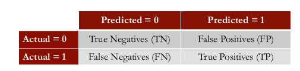
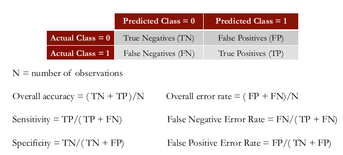

```{r setup, cache = FALSE, echo = FALSE, message = FALSE, warning = FALSE, tidy = FALSE}
require(knitr)
options(width = 160, scipen = 5)
# options(width = 100, digits = 7)
opts_chunk$set(message = FALSE, error = FALSE, warning = FALSE, 
               collapse = TRUE, tidy = FALSE,
               cache = TRUE, cache.path = '.cache/', 
               fig.align = 'left', dpi = 100, fig.path = './figures/Modeling_expert/')
# opts_chunk$set(dev="png", 
#                dev.args=list(type="cairo"),
#                dpi=96)
```

## PRELIMINARIES

Libraries needed for data processing and plotting:
```{r load_packages, cache = FALSE, echo = TRUE, message = FALSE, warning = FALSE, tidy = FALSE}
library("dplyr")
library("magrittr")
library("ggplot2")

library("caTools")
library("ROCR")
```


## ABOUT THE DATA

The objective was to assess quality, health care quality.
So we used a large health insurance claims database, and we randomly selected 131 diabetes patients.

* Large health insurance claims database.
* Randomly selected 131 diabetes patients.
* Ages: from 35 to 55
* Costs: $10,000 - $20,000
* The period in which these claims were recorded: September 1, 2003 - August 31, 2005

An expert physician reviewed the claims and wrote descriptive notes and rated the quality of care
on a __two-point scale__, __poor__ or __good__.

### Variable Extraction

* Dependent Variable
    * Quality of care, a _categorical variable_.
* Independent Variables
    * ongoing use of narcotics.
    * only on Avandia, not a good first choice drug.
    * Had regular visits, mammogram, and immunizations.
    * Was given home testing supplies.


## LOADING THE DATA

Read the dataset `quality`.
```{r load_data}
quality <- read.csv("data/quality.csv")

str(quality)
```

The variables in the dataset `quality.csv` are as follows:

* __MemberID__ numbers the patients from 1 to 131, and is just an identifying number.
* __InpatientDays__ is the number of inpatient visits, or number of days the person spent in the hospital.
* __ERVisits__ is the number of times the patient visited the emergency room.
* __OfficeVisits__ is the number of times the patient visited any doctor's office.
* __Narcotics__ is the number of prescriptions the patient had for narcotics.
* __DaysSinceLastERVisit__ is the number of days between the patient's last emergency room visit and the end of the study period (set to the length of the study period if they never visited the ER). 
* __Pain__ is the number of visits for which the patient complained about pain.
* __TotalVisits__ is the total number of times the patient visited any healthcare provider.
* __ProviderCount__ is the number of providers that served the patient.
* __MedicalClaims__ is the number of days on which the patient had a medical claim.
* __ClaimLines__ is the total number of medical claims.
* __StartedOnCombination__ is whether or not the patient was started on a combination of drugs to treat their diabetes (TRUE or FALSE).
* __AcuteDrugGapSmall__ is the fraction of acute drugs that were refilled quickly after the prescription ran out.
* __PoorCare__ is the outcome or dependent variable, and is equal to `1` if the patient had poor care, and equal to `0` if the patient had good care.

```{r plot_1}
# mycolors <- c("blue2", "red2")
mycolors <- c("forestgreen", "firebrick2")
ggplot(data = quality, aes(x = OfficeVisits, y = Narcotics)) + theme_bw() + 
    scale_colour_manual(values = mycolors) +
    xlab("Number of Office Visits") + 
    ylab("Number of Narcotics Prescribed") + 
    geom_point(aes(col = factor(PoorCare), alpha = 0.5), pch = 16, size = 4.0)
```

This plot shows two of our independent variables,

* the number of office visits on the x-axis (`OfficeVisits`), and 
* the number of narcotics prescribed on the y-axis (`Narcotics`).

Each point is an observation or a patient in our data set.  
The red points are patients who received poor care, and the green points are patients who received good care.
It looks like maybe _more office visits_ and _more narcotics_ are more likely to correspind to _poor care_.


## Model Healthcare Quality

Let's see if we can build a logistic regression model to better predict poor care.

### Baseline Model

```{r table_data}
tmp <- table(quality$PoorCare)
tmp
```
In a classification problem, a standard baseline method is to just predict the most frequent
outcome for all observations.
Since good care is more common than poor care, in this case, we would predict that all patients
are receiving good care.

If we did this, we would get `r tmp[1]` out of the `r sum(tmp)` observations correct, or have an
__accuracy__ of about __`r round(100*tmp[1]/sum(tmp),0)`%__.
This is the accuracy of the _baseline model_.
This is what we'll try to beat with our logistic regression model.


### Preparing data for modeling : Create _training_ and _testing_ sets 

Randomly split data creating a dummy variable:

```{r split_data}
# for Reproducibility
set.seed(88)
split <- sample.split(quality$PoorCare, SplitRatio = 0.75)
```

The function `sample.split()` randomly splits the data, while making sure that the _outcome
variable is well-balanced in each piece_.
We saw earlier that about 75% of our patients are receiving good care.
This function makes sure that in our training set, 75% of our patients are receiving good care and
in our testing set 75% of our patients are receiving good care.   
We want to do this so that our test set is representative of our training set.

```{r train_and_test_sets}
qualityTrain <- subset(quality, split == TRUE)

qualityTest <- subset(quality, split == FALSE)
```

### Logistic Regression Model

As independent variabiles we use `OfficeVisits` and `Narcotics`.

```{r logit_regr_model}
QualityLog <- glm(PoorCare ~ OfficeVisits + Narcotics, data = qualityTrain, family = binomial)
```

The option `family = binomial` tells `glm()` that we want a logistic regression.

Let's look at the results:
```{r logit_regr_model_summary}
summary(QualityLog)
```

What we want to focus on is the coefficients table.  This gives the estimate values for the
coefficients, or the _betas_, for our logistic regression model.  
We see here that the coefficients for `OfficeVisits` and `Narcotics` are both positive, which
means that higher values in these two variables are indicative of poor care as we suspected from
looking at the data.

The last thing we want to look at in the output is the __AIC__ value.
This is a measure of the quality of the model and is like _Adjusted R-squared_ in that it accounts
for the number of variables used compared to the number of observations.

Unfortunately, it can only be compared between models on the same data set.
But it provides a means for model selection.  
The preferred model is the one with the _minimum AIC_.


### Make predictions on training set

```{r predict_on_training}
predictTrain <- predict(QualityLog, type="response")
```

Analyze predictions.   
Since we're expecting probabilities, all of the numbers should be between zero and one.  
And we see that the minimum value is about 0.07 and the maximum value is 0.98.
```{r check_predictions_1}
summary(predictTrain)
```

Let's see if we are predicting higher probabilities for the actual poor care cases as we expect.
To do this, use the `tapply()` function, giving as arguments `predictTrain` and then
`QualityTrain$PoorCare` and then `mean` (the function to be applied).
This will compute the average prediction for each of the true outcomes.

```{r check_predictions_2}
tapply(predictTrain, qualityTrain$PoorCare, mean)
```

### Probability to _Prediction_: Threshold Value

The outcome of a logistic regression model is a probability.
Often, we want to make a binary prediction. 

* Did this patient receive poor care or good care?

We can do this using a threshold value _t_

* If $P(PoorCare = 1) \ge t$, predict poor quality.
* If $P(PoorCare = 1) < t$, predict good quality.


#### Two Types of Errors

There are two types of errors that a model can make:

* ones where we predict 1, or poor care, but the actual outcome is 0, and 
* ones where we predict 0, or good care, but the actual outcome is 1.


#### What value should we pick for _t_?

The threshold value is often selected based on which _errors are "better"_

* If _t_ is large, predict poor care rarely.
    * More errors where we say good care, but it is actually poor care.
    * Detects patients who are receiving the worst care
* If _t_ is small, predict good care rarely.
    * More errors where we say poor care, but it is actually good care
    * Detects all patients who might be receiving poor care
* With no preference between the errors, select $t = 0.5$.
    * Predicts the more likely outcome


Compare actual outcomes to predicted outcomes using a _confusion matrix_ (_classification matrix_):



This compares the actual outcomes to the predicted outcomes.
The rows are labeled with the actual outcome, and the columns are labeled with the predicted outcome.
Each entry of the table gives the number of data observations that fall into that category.

These are the two combinations that correspond to correct predictions:

* The _true negatives_, or __TN__, is the number of observations that are actually good care and for which we predict good care.
* The _true positives_, or __TP__, is the number of observations that are actually poor care and for which we predict poor care.

And two combinations that are _bad_:

* The _false positives_, or __FP__, are the number of data points for which we predict poor care, but they're actually good care.
* The _false negatives_, or __FN__, are the number of data points for which we predict good care, but they're actually poor care.


A couple of important definitions of outcome measures that help us determine what types of
errors we are making:

* __sensitivity__ = $\frac{TP}{TP + FN}$

* __specificity__ = $\frac{TN}{TN + FP}$


### Threshold vs. Sensitivity (Specificity)

* A model with a higher threshold will have a lower sensitivity and a higher specificity.
* A model with a lower threshold will have a higher sensitivity and a lower specificity.

Let's compute some confusion matrices using different threshold values.

#### __Threshold = 0.5__

```{r table_0p5}
tmp <- table(qualityTrain$PoorCare, predictTrain > 0.5)
tmp 
```
* Sensitivity = `r tmp[2,2]` / `r sum(tmp[2,])` = `r round(tmp[2,2]/sum(tmp[2,]),2)`     
  Specificity = `r tmp[1,1]` / `r sum(tmp[1,])` = `r round(tmp[1,1]/sum(tmp[1,]),2)`    

#### __Threshold = 0.7__

```{r table_0p7}
tmp <- table(qualityTrain$PoorCare, predictTrain > 0.7)
tmp
```
* Sensitivity = `r tmp[2,2]` / `r sum(tmp[2,])` = `r round(tmp[2,2]/sum(tmp[2,]),2)`     
  Specificity = `r tmp[1,1]` / `r sum(tmp[1,])` = `r round(tmp[1,1]/sum(tmp[1,]),2)`    

* By increasing the threshold, our sensitivity went down and our specificity went up.


#### __Threshold = 0.2__

```{r table_0p2}
tmp <- table(qualityTrain$PoorCare, predictTrain > 0.2)
tmp
```
* Sensitivity = `r tmp[2,2]` / `r sum(tmp[2,])` = `r round(tmp[2,2]/sum(tmp[2,]),2)`     
  Specificity = `r tmp[1,1]` / `r sum(tmp[1,])` = `r round(tmp[1,1]/sum(tmp[1,]),2)`    
* So with the lower threshold, our sensitivity went up, and our specificity went down.

__But which threshold should we pick?__


### Receiver Operator Characteristic (ROC) Curve


Picking a good threshold value is often challenging. 
A _Receiver Operator Characteristic_ curve, or _ROC curve_, can help you decide which value of the
threshold is best.

The ROC curve for our problem is shown below.

* The sensitivity, or true positive rate of the model, is shown on the y-axis.
* The false positive rate, or 1 minus the specificity, is given on the x-axis.

The line shows how these two outcome measures vary with different threshold values.

The ROC curve captures all thresholds simultaneously.

* The higher the threshold, or closer to (0, 0), the higher the specificity and the lower the sensitivity.
* The lower the threshold, or closer to (1, 1), the higher the sensitivity and lower the specificity.

### ROC for our model

```{r ROCR_pred}
# Prediction function
ROCRpred <- prediction(predictTrain, qualityTrain$PoorCare)
```
The `ROCRpred()` function takes two arguments.  

* The first is the predictions we made with our model, which we called `predictTrain`.
* The second argument is the true outcomes of our data points, which in our case, is `qualityTrain$PoorCare`.


```{r ROCR_perf}
# Performance function
ROCRperf <- performance(ROCRpred, "tpr", "fpr")

# Plot ROC curve
# plot(ROCRperf, main = "Receiver Operator Characteristic Curve", lwd = 3)

# Add colors
# plot(ROCRperf, main = "Receiver Operator Characteristic Curve", lwd = 3, colorize = TRUE)

# Add threshold labels 
plot(ROCRperf, main = "Receiver Operator Characteristic Curve", lwd = 3, colorize = TRUE, 
     print.cutoffs.at=seq(0,1,by=0.1), text.adj=c(-0.2,1.7))
```

* At the point (0, 0.4), you're correctly labeling about 40% of the poor care cases with a very small false positive rate.
* At the point (0.6, 0.9), you're correctly labeling about 90% of the poor care cases, but have a false positive rate of 60%.
* In the middle, around (0.3, 0.8), you're correctly labeling about 80% of the poor care cases, with a 30% false positive rate.

#### __So which threshold value should you pick?__

You should select the best threshold for the trade-off you want to make considering:

* cost of failing to detect positives
* costs of raising false alarms

So, 

* If you're more concerned with having a high specificity or low false positive rate, 
    * pick the threshold that maximizes the true positive rate while keeping the false positive rate really low.    
    * A threshold around (0.1, 0.5) on this ROC curve looks like a good choice in this case.

* On the other hand, if you're more concerned with having a high sensitivity or high true positive rate, 
    * pick a threshold that minimizes the false positive rate but has a very high true positive rate.  
    * A threshold around (0.3, 0.8) looks like a good choice in this case.


## INTERPRETING THE MODEL

Let us examine how to interpret the model we developed.

### Multicollinearity

One of the things we should look after is that there might be what is called __multicollinearity__.   
Multicollinearity occurs when the various independent variables are correlated, and this might
confuse the coefficients (the _beta_s) in the model.

We can test this by checking the correlations of independent variables.
If they are excessively high, this would mean that there might be multicollinearity, and you have to potentially revisit the model,

We should also consider whether or not the signs of the model coefficients make sense.
Is the coefficient beta positive or negative?   
If it agrees with intuition, then multicollinearity has not been a problem, but if intuition suggests
a different sign, this might be a sign of multicollinearity.


### Significance (_Area Under the Curve_, _AUC_)

The next important element is __significance__.   
So how do we interpret the results, and how do we understand whether we have a good model or not?

For that purpose, let's take a look at what is called _Area Under the Curve_, or _AUC_ for short.
The _Area Under the Curve_ shows an absolute measure of quality of prediction.
In this particular case, __`r round(100*as.numeric(performance(ROCRpred, "auc")@y.values), 1)`%__.   
Given that the perfect score is 100%, this is like a _B_.

So the area under the curve gives an absolute measure of quality, and it's _less affected by various benchmarks_.
It illustrates how accurate the model is on a more absolute sense.


### Other Outcome Measures (confusion matrix)




## Making Predictions Out Of Sample

Just like in linear regression, we want to make predictions on a test set to compute _out-of-sample metrics_.
We set aside 25% of our data, _i.e._ 32 cases, as a _test set_, against which we can compare the predicted
outcomes of the model that was trained on the other 75% of the data.

```{r out_of_sample}
predictTest <- predict(QualityLog, type = "response", newdata = qualityTest)
ROCRpredTest <- prediction(predictTest, qualityTest$PoorCare)
auc <- as.numeric(performance(ROCRpredTest, "auc")@y.values)
```
The _AUC_ of this model on the _test data_ is __`r round(100*auc,1)`%__.

If we use a threshold value of 0.3, we get the following _confusion matrix_:

```{r confmat_test_0p3}
tmp <- table(qualityTest$PoorCare, predictTest > 0.3)
tmp 
```
* Overall Accuracy = `r round((tmp[1,1]+tmp[2,2])/sum(tmp), 2)`
* Sensitivity = `r tmp[2,2]` / `r sum(tmp[2,])` = `r round(tmp[2,2]/sum(tmp[2,]),2)` ( = TP rate)
* Specificity = `r tmp[1,1]` / `r sum(tmp[1,])` = `r round(tmp[1,1]/sum(tmp[1,]),2)`
* FP rate = `r tmp[1,2]` / `r sum(tmp[1,])` = `r round(tmp[1,2]/sum(tmp[1,]),2)`


### Comparison with _Baseline Model_

The _baseline model_ would predict good care all the time.
In that case, we will be correct `r sum(tmp[1,])` times, versus `r tmp[1,1]+tmp[2,2]` times, in our case.   
But notice that predicting always good care does not capture the dynamics of what is happening,
versus the logistic regression model that is far more intelligent in capturing these effects.

## CONCLUSIONS

* An expert-trained model can accurately identify diabetics receiving low-quality care
    * Out-of-sample accuracy of 78%.
    * Identifies most patients receiving poor care

* In practice, the probabilities returned by the logistic regression model can be used to
prioritize patients for intervention

* Electronic medical records could be used in the future

### The Competitive Edge of Models 

* While humans can accurately analyze small amounts of information, models allow larger scalability
* Models do not replace expert judgment
    * Experts can improve and refine the model
* Models can integrate assessments of many experts into one final unbiased and unemotional prediction


---
