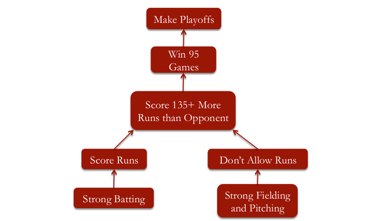
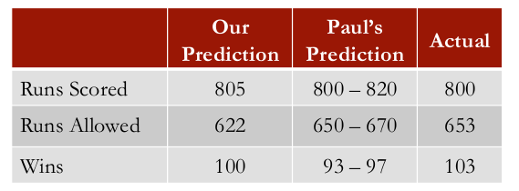

```{r setup, cache = FALSE, echo = FALSE, message = FALSE, warning = FALSE, tidy = FALSE}
require(knitr)
options(width = 160, scipen = 5)
# options(width = 100, digits = 7)
opts_chunk$set(message = FALSE, error = FALSE, warning = FALSE, 
               collapse = TRUE, tidy = FALSE,
               cache = TRUE, cache.path = '.cache/', 
               fig.align = 'left', dpi = 100, fig.path = 'figures/Moneyball/')
# opts_chunk$set(dev="png", 
#                dev.args=list(type="cairo"),
#                dpi=96)
```

## PRELIMINARIES

Libraries needed for data processing and plotting:
```{r load_packages, cache = FALSE, echo = TRUE, message = FALSE, warning = FALSE, tidy = FALSE}
library("dplyr")
library("magrittr")
library("ggplot2")
```

Source external script with my own handy functions definitions:
```{r load_my_functions}
source("./scripts/my_defs_u2.R")
```
The content of this external file is included in the Appendix at the end of this report.


## LOADING THE DATA

Read the dataset `baseball.csv`.
```{r load_data, eval = TRUE, cache = TRUE}
baseball <- read.csv("data/baseball.csv")
str(baseball)
```

## Part 2 : MAKING IT TO THE PLAYOFFS

Subsetting data for the 1996-2001 period:

```{r sec2-subset, eval = TRUE, cache = TRUE}
moneyball_1996_2001 <- subset(baseball, Year < 2002 & Year >= 1996)
# str(moneyball_1996_2001)
```

```{r sec1-plot_1, eval = TRUE, cache = TRUE}
ggplot(data = moneyball_1996_2001, aes(x = W, y = Team)) + theme_bw() + 
    scale_color_manual(values = c("grey", "red3")) + 
    geom_vline(xintercept = c(85.0, 95.0), col = "green2", linetype = "longdash") +
    geom_point(aes(color = factor(Playoffs)), pch = 16, size = 3.0)
```


###  How does a team win games?

* They score more runs than their opponent
* But how many more?
* The A’s calculated that they needed to score 135 more runs than they allowed during the regular season to expect to win 95 games
* Let’s see if we can verify this using linear regression

Subset to only include moneyball years

```{r subset, eval = TRUE, cache = TRUE}
moneyball <- subset(baseball, Year < 2002)
str(moneyball)
```

Compute run difference and define new variable `RD` added to the `moneyball` data frame:

```{r runs_diff, eval = TRUE, cache = TRUE}
moneyball$RD <- moneyball$RS - moneyball$RA
# str(moneyball)
```

Scatterplot to check for linear relationship between `RD` and wins (`W`):

```{r sec2-plot_1, eval = TRUE, cache = TRUE}
# plot(moneyball$RD, moneyball$W)
ggplot(data = moneyball, aes(x = RD, y = W)) + theme_bw() + 
    scale_color_manual(values = c("grey", "red3")) + 
    geom_hline(yintercept = c(85.0, 95.0), col = "green2", linetype = "longdash") +
    geom_point(aes(color = factor(Playoffs)), alpha = 0.5, pch = 16, size = 3.0) 
```

#### Regression model to predict wins

Given the clear correlation between `RD` and `W`, it makes sense to try first a linear
regression with just `RD` as predictor.

```{r sec2-lm_1, eval = TRUE, cache = TRUE}
Wins_Reg <- lm(W ~ RD, data = moneyball)

printStats(Wins_Reg)
```
$$
W = `r round(Wins_Reg$coeff[1],3)` + `r round(Wins_Reg$coeff[2],3)`*RD
$$

Then one can compute the `RD` needed to get $W\ge95$, i.e. $RD \ge `r round((95.0 - Wins_Reg$coeff[1])/Wins_Reg$coeff[2], 1)`$.


## Part 3 : PREDICTING RUNS




### Scoring Runs

How does a team score more runs?  
The A's discovered that two baseball statistics were significantly more important than anything else

* __On-Base Percentage__ (`OBP`)
    * Percentage of time a player gets on base (including walks).
* __Slugging Percentage__ (`SLG`)
    * How far a player gets around the bases on his turn (measures power).

Most teams focused on Batting Average (`BA`)

* Getting on base by hitting the ball.

The A's claimed that:

* On-Base Percentage was the most important.
* Slugging Percentage was important.
* Batting Average was _overvalued_.

We use linear regression to verify which baseball stats are more important to predict runs.

### Predicting Runs Scored

We can use pitching statistics to predict _runs scored_:

* On-Base Percentage (`OBP`)
* Slugging Percentage (`SLG`)


#### Regression model with 3 predictors (`OBP`, `SLG`, `BA`)

```{r sec3-lm_1, eval = TRUE, cache = TRUE}
RS_reg_1 <- lm(RS ~ OBP + SLG + BA, data = moneyball)

printStats(RS_reg_1)
```

If we take a look at the summary of our regression equation, we can see that all of our independent variables
are significant, and our $R^2$ __`r round(summary(RS_reg_1)$r.squared, 4)`__.

But if we look at our coefficients, we can see that the coefficient for batting average is negative.  
This implies that, all else being equal, a team with a lower batting average will score more runs, 
which is a little counterintuitive.

What's going on here is a case of __multicollinearity__.  
These three hitting statistics are highly correlated, so it's hard to interpret the coefficients of our model.

#### Regression model with 2 predictors (`OBP`, `SLG`)

Let's try removing batting average, the variable with the least significance, to see what happens to our model.

```{r sec3-lm_2, eval = TRUE, cache = TRUE}
RS_reg_2 <- lm(RS ~ OBP + SLG, data = moneyball)

printStats(RS_reg_2)
```

We get the linear regression model:
$$
RS = `r round(RS_reg_2$coeff[1],2)` + `r round(RS_reg_2$coeff[2],2)`*OBP  + `r round(RS_reg_2$coeff[3],2)`*SLG
$$
with and $R^2$ = __`r round(summary(RS_reg_2)$r.squared, 4)`__.  

So this model is simpler, with only two independent variables, and has about the same $R^2$.
Overall a better model.

```{r sec3-save_lm, eval = TRUE, cache = TRUE, echo = FALSE}
RS_reg <- RS_reg_2
```

We can see that on-base percentage has a larger coefficient than slugging percentage.  
Since these variables are on about the same scale, this tells us that on-base percentage is probably
worth more than slugging percentage.

So by using linear regression, we're able to verify the claims made in Moneyball:

* that batting average is overvalued,
* on-base percentage is the most important, and slugging
* percentage is important for predicting runs scored.


### Allowing Runs

We can use pitching statistics to predict __runs allowed__:

* __Opponents On-Base Percentage__ (`OOBP`)
* __Opponents Slugging Percentage__ (`OSLG`)

```{r sec3-lm_3, eval = TRUE, cache = TRUE}
RA_reg <- lm(RA ~ OOBP + OSLG, data = moneyball)

printStats(RA_reg)
```

We get the linear regression model:
$$
RA = `r round(RA_reg$coeff[1],2)` + `r round(RA_reg$coeff[2],2)`*OOBP  + `r round(RA_reg$coeff[3],2)`*OSLG
$$
with and $R^2$ = __`r round(summary(RA_reg)$r.squared, 4)`__.
Both variables are significant.


## Part 4 : USING THE MODELS TO MAKE PREDICTIONS

Can we predict how many games the 2002 Oakland A's will win using our models?

* The models for runs use team statistics.  
* Each year, a baseball team is different.
* We need to estimate the new team statistics using past player performance.
    * Assumes past performance correlates with future performance
    * Assumes few injuries
* We can estimate the team statistics for 2002 by using the 2001 player statistics

### Predicting Runs Scored

At the beginning of the 2002 season, the Oakland A's had 24 batters on their roster.  
Using the 2001 regular season statistics for these players:

* Team `OBP` is 0.339
* Team `SLG` is 0.430

Our regression equation was:
$$
RS = `r round(RS_reg$coeff[1],2)` + `r round(RS_reg$coeff[2],2)`*OBP  + `r round(RS_reg$coeff[3],2)`*SLG
$$
```{r sec4-rs, eval = TRUE, cache = FALSE, echo = FALSE}
RSstats2001 <- c(1, 0.339, 0.430)
RSpred2002 <- RS_reg$coeff %*% RSstats2001
```
Based on this, our prediction for 2002 would then be __`r round(RSpred2002,1)`__.

### Predicting Runs Allowed

At the beginning of the 2002 season, the Oakland A's had 17 pitchers on their roster.
Using the 2001 regular season statistics for these players:
* Team `OOBP` is 0.307
* Team `OSLG` is 0.373

Our regression equation was
$$
RA = `r round(RA_reg$coeff[1],2)` + `r round(RA_reg$coeff[2],2)`*OOBP  + `r round(RA_reg$coeff[3],2)`*OSLG
$$
```{r sec4-ra, eval = TRUE, cache = FALSE, echo = FALSE}
RAstats2001 <- c(1, 0.307, 0.373)
RApred2002 <- RA_reg$coeff %*% RAstats2001
```
Based on this, our prediction for 2002 would then be __`r round(RApred2002,1)`__.

### Predicting Wins

We can now make a prediction for how many games they will win.  
Our regression equation to predict wins was:
$$
W = `r round(Wins_Reg$coeff[1],3)` + `r round(Wins_Reg$coeff[2],3)`*RD
$$

We predicted `r round(RSpred2002,1)` runs scored (`RS`) and `r round(RApred2002,1)` runs allowed (`RA`), 
for a difference `RD` of `r round(RSpred2002,1) - round(RApred2002,1)`
```{r sec4-wins, eval = TRUE, cache = FALSE, echo = FALSE}
RDpred2002 <- RSpred2002 - RApred2002
Wpred2002 <- Wins_Reg$coeff %*% c(1, RDpred2002)
```

We can plug in this `RD` to __predict__ that the A's will win __`r round(Wpred2002,1)`__ games in 2002.


### How does this predictions compare with actual results for 2002?

Paul DePodesta used a similar approach to make predictions.  
Predictions closely match actual performance



The A's set a League record by winning 20 games in a row.  
Won one more game than the previous year, and made it to the playoffs.


## Part 5 : WINNING THE WORLD SERIES

### Luck in the Playoffs

Billy and Paul see their job as making sure the team makes it to the playoffs – after that all bets are off.

* The A's made it to the playoffs in 2000, 2001, 2002, 2003.
* But they didn't win the World Series.

Why?

* _"Over a long season the luck evens out, and the skill shines through.  
But in a series of three out of five, or even four out of seven, anything can happen."_"

In other words, the playoffs suffer from the sample size problem.  
There are not enough games to make any statistical claims.  
Let's see if we can verify this using our data set.

### Is Playoff Performance Predictable?

We can compute the correlation between whether or not the team wins the World Series (a binary variable) 
and the number of regular season wins, since we would expect teams with more wins to be more likely 
to win the World Series.

* Using data 1994-2011 (8 teams in the playoffs).
* Correlation between winning the World Series and regular season wins is 0.03. Very low.
* Winning regular season games gets you to the playoffs.
* But in the playoffs, there are too few games for luck to even out.
* _Logistic regression_ can be used to predict whether or not a team will win the World Series.

```{r sec5-subset, eval = TRUE, cache = FALSE}
recent <- subset(baseball, Year >= 1994 & Year <= 2011)

recent[recent$RankPlayoffs == 1 & is.na(recent$RankPlayoffs) == FALSE, ]
```

```{r sec5-WS_W_cor, eval = TRUE, cache = FALSE}
recent$WSwin <- 0
recent[recent$RankPlayoffs == 1 & is.na(recent$RankPlayoffs) == FALSE, "WSwin"] <- 1
cor(recent$WSwin, recent$W)

clean <- recent[is.na(recent$RankPlayoffs) == FALSE, ]
# cor(clean$W, clean$WSwin)
```

---

## APPENDIX : external functions

```{r echo = FALSE, cache = FALSE}
read_chunk("./scripts/my_defs_u2.R")
```

Additional locally defined functions, from the external file loaded at the beginning.
```{r eval = FALSE, cache = FALSE}
<<my_handy_defs>>
```

