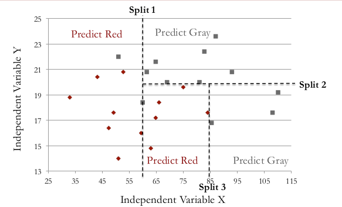
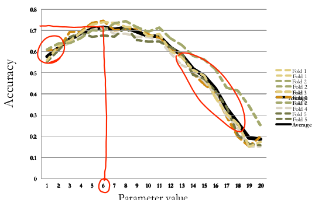
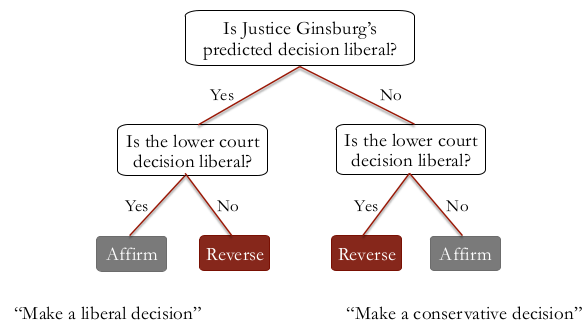

```{r setup, cache = FALSE, echo = FALSE, message = FALSE, warning = FALSE, tidy = FALSE}
require(knitr)
options(width = 160, scipen = 5)
# options(width = 100, digits = 7)
opts_chunk$set(message = FALSE, error = FALSE, warning = FALSE, 
               collapse = TRUE, tidy = FALSE,
               cache = FALSE, cache.path = '.cache/', 
               fig.align = 'left', dpi = 100, fig.path = 'figures/Supreme_Court/')
# opts_chunk$set(dev="png", 
#                dev.args=list(type="cairo"),
#                dpi=96)
```

[ [source files available on GitHub](https://github.com/pedrosan/TheAnalyticsEdge) ]

## PRELIMINARIES

Libraries needed for data processing and plotting:
```{r load_packages, cache = FALSE, echo = TRUE, message = FALSE, warning = FALSE, tidy = FALSE}
library("dplyr")
library("magrittr")
library("ggplot2")

library("caTools")
library("rpart")
library("rpart.plot")
library("ROCR")
library("randomForest")
library("caret")
library("e1071")
```

## INTRODUCTION

In 2002, Andrew Martin, a professor of political science at Washington University in St.
Louis, decided to instead predict decisions using a statistical model built from
data Together with his colleagues, he decided to test this model against a panel of
experts

Martin used a method called _Classification and Regression Trees_ (__CART__)

Why not logistic regression?

* Logistic regression models are generally not interpretable
* Model coefficients indicate importance and relative effect of variables, but do not give a
  simple explanation of how decision is made


## ABOUT THE DATA

Cases from 1994 through 2001.

In this period, the same nine justices presided SCOTUS: 

* Breyer, Ginsburg, Kennedy, O'Connor, Rehnquist (Chief Justice), Scalia, Souter, Stevens, Thomas.
* Rare data set - longest period of time with the same set of justices in over 180 years.

We will focus on predicting Justice Stevens' decisions:

* Started out moderate, but became more liberal
* Self-proclaimmed conservative


### The Variables

In this problem, our __dependent variable__ is whether or not Justice Stevens voted to reverse the
lower court decision.   
This is a binary variable, __Reverse__, taking values:

* __1__ if Justice Stevens decided to __reverse__ or overturn the lower court decision.
* __0__ if Justice Stevens voted to __affirm__ or maintain the lower court decision.

Our __independent variables__ are six different properties of the case.

* __Circuit__: Circuit court of origin, _13 courts_ (1st - 11th , DC, FED).
* __Issue__: Issue area of case, _11 areas_ (_e.g._, civil rights, federal taxation).
* __Petitioner__: type of petitioner, _12 categories_ (_e.g._, US, an employer).
* __Respondent__: type of respondent _12 categories_ (same as for _Petitioner_).
* __LowerCourt__: Ideological direction of lower court decision (this was based on the judgment by
                  the authors of the study), _2 categories_:
    * __conservative__ 
    * __liberal__
* __Unconst__: whether petitioner argued that a law/practice was unconstitutional, _binary variable_.


## LOADING THE DATA

```{r load_data}
stevens_full <- read.csv("data/stevens.csv", stringsAsFactor = TRUE)
```

```{r show_data}
str(stevens_full)
```

Some of the variables are not interesting for our purpose, namely `Docket` and `Term` and
we remove them.
```{r exclude_variables}
stevens <- stevens_full[, -c(1, 2)]
```

## Logistic Regression

We can try to use logistic regression.

```{r logRegr_model}
# model_LogRegr <- glm(Reverse ~ . - Docket - Term, data = stevens, family = binomial)
model_LogRegr <- glm(Reverse ~ ., data = stevens, family = binomial)

summary(model_LogRegr)
```

We get a model where some of the most significant variables are: 

* whether or not the case is from the 2nd circuit court, with a coefficient of __`r round(model_LogRegr$coeff["Circuit2nd"], 3)`__
* whether or not the case is from the 4th circuit court, with a coefficient of __`r round(model_LogRegr$coeff["Circuit4th"], 3)`__ 
* whether or not the lower court decision was liberal, with a coefficient of __`r round(model_LogRegr$coeff["LowerCourtliberal"], 3)`__ 

While this tells us that the case being from the 2nd or 4th circuit courts is predictive of
Justice Stevens reversing the case, and the lower court decision being liberal is predictive of
Justice Stevens affirming the case, it's _difficult to understand which factors are more
important_ due to things like the __scales of the variables__, and the __possibility of multicollinearity__.   

It's also difficult to quickly evaluate what the __prediction__ would be for a __new case__.


## Classification and Regression Trees (_CART_)

So instead of logistic regression, Martin and his colleagues used a method called 
_classification and regression trees_, or __CART__.

This method builds what is called a _tree_ by __splitting on the values of the independent variables__.   
To predict the outcome for a new observation or case, you can follow the splits in the tree and at
the end, you predict the most frequent outcome in the training set that followed the same path.

Some advantages of _CART_ are that:

* it __does not assume a linear model__, like logistic regression or linear regression, and 
* it is a __very interpretable__ model.


### Example of CART splits

This plot shows sample data for two independent variables, _x_ and _y_, and each data point is
colored by the outcome variable, red or gray.   
CART tries to split this data into subsets so that _each subset is as pure or homogeneous as possible_.
The first three splits that CART would create are shown here.



Then the standard prediction made by a _CART_ model is just a __majority vote__ within each subset.


A _CART_ model is represented by what we call a __tree__.


The tree for the splits we just generated is shown on the right.

* The first split tests whether the variable $x < 60$.  
    * If yes, the model says to predict red, and 
    * If no, the model moves on to the next split.

* The second split checks whether or not $y < 20$.  
    * If no, the model says to predict gray.
    * If yes, the model moves on to the next split.

* The third split checks whether or not $x < 85$.
    * If yes, then the model says to predict red, and 
    * if no, the model says to predict gray.


### CART and splitting

In the previous example shows a _CART_ tree with three splits, but why not two, or four, or even five?

There are different ways to _control how many splits are generated_.  

* One way is by __setting a lower bound for the number of data points in each subset__.   
  In __R__, this is called the `minbucket` parameter, for the minimum number of observations in each bucket or subset.   
  The _smaller_ `minbucket` is, the more splits will be generated.  But if it's too small, overfitting will occur.   
  This means that _CART_ will fit the training set almost perfectly.   
  This is bad because then the model will probably not perform well on test set data or new data.   
  On the other hand, if the `minbucket` parameter is _too large_, the model will be too simple and the accuracy will be poor.


### Predictions from _CART_ 

In each subset of a _CART_ tree, we have a bucket of observations, which may contain both possible outcomes.
In the Supreme Court case, we will be classifying observations as either _affirm_ or _reverse_, again a binary outcome,
as in the example shown above. 

In the example we classified each subset as either red or gray depending on the __majority__ in that subset.

Instead of just taking the majority outcome to be the prediction, we can __compute the percentage__ of
data in a subset of each type of outcome.  As an example, if we have a subset with 10 affirms and
two reverses, then 83% of the data is affirm.    
Then, just like in logistic regression, we can use a __threshold__ value __to obtain our prediction__.    
For this example, we would predict affirm with a _threshold of 0.5_ since the majority is affirm.

But if we increase that _threshold to 0.9_, we would predict reverse for this example.

Then by varying the threshold value, we can compute an __ROC curve__ and compute an __AUC__ value
__to evaluate our model__.


## A MODEL FOR THE SUPREME COURT DECISIONS

###  Split the data into training and testing sets

First we split our entire data set into _training_ and _test_ sets, with 70/30 split:
```{r split_data}
set.seed(3000)

spl <- sample.split(stevens$Reverse, SplitRatio = 0.7)
Train <- subset(stevens, spl == TRUE)
Test <- subset(stevens, spl == FALSE)
```

### Fit _Logistic Regression_ model

As a reference we also fit a _logistic regression_ model to the _training_ data set:
```{r model_LogRegr}
# model_LogRegr <- glm(Reverse ~ . - Docket - Term, data = Train, family = binomial)
model_LogRegr <- glm(Reverse ~ ., data = Train, family = binomial)

summary(model_LogRegr)
```

#### Out-of-Sample predictions of the _Logistic Regression_ model

```{r model_LogRegr_predict_test}
predict_LogRegr_Test <- predict(model_LogRegr, type = "response", newdata = Test)
```
```{r model_LogRegr_predict_test_confusion_matrix}
cmat_LR <- table(Test$Reverse, predict_LogRegr_Test > 0.5)

cmat_LR 
accu_LR <- (cmat_LR[1,1] + cmat_LR[2,2])/sum(cmat_LR)
```
* Overall Accuracy = __`r round(accu_LR,4)`__    
  Sensitivity = `r cmat_LR[2,2]` / `r sum(cmat_LR[2,])` = __`r round(cmat_LR[2,2]/sum(cmat_LR[2,]),4)`__ ( = TP rate)    
  Specificity = `r cmat_LR[1,1]` / `r sum(cmat_LR[1,])` = __`r round(cmat_LR[1,1]/sum(cmat_LR[1,]),4)`__    
  FP rate = `r cmat_LR[1,2]` / `r sum(cmat_LR[1,])` = __`r round(cmat_LR[1,2]/sum(cmat_LR[1,]),4)`__


### Fit _CART_ model

```{r model_CART}
model_CART <- rpart(Reverse ~ Circuit + Issue + Petitioner + Respondent + LowerCourt + Unconst, 
                     data = Train, 
                     method = "class", 
                     minbucket = 25)
```
A couple of notes about the parameters used in the function call:

* `method = "class"` tells `rpart` to build a _classification tree_, instead of a _regression tree_.   
* `minbucket = 25` limits the tree so that it does not overfit to our training set.    
   We selected a value of 25, but we could pick a smaller or larger value.    
   We will see another way to limit the tree later in this lecture.


The model can be be represented as a _decision tree_:
```{r model_CART_plot, fig.width = 7, fig.height = 7}
# from 'rpart'
prp(model_CART)
```
Comparing this to a logistic regression model, we can see that it is __very interpretable__.  
A _CART tree_ is a series of __decision rules__ which can easily be explained.


#### Out-of-Sample predictions of the _CART_ model

```{r model_CART_predict_test}
predict_CART_Test <- predict(model_CART, newdata = Test, type = "class")
```
* We need to give `type = "class"` if we want the majority class predictions.   
  This is like using a _threshold of 0.5_.

We will see in shortly how we can leave this argument out and still get probabilities from our CART model.

```{r model_CART_predict_test_confusion_matrix}
cmat_CART <- table(Test$Reverse, predict_CART_Test)

cmat_CART 
accu_CART <- (cmat_CART[1,1] + cmat_CART[2,2])/sum(cmat_CART)
```
* Overall Accuracy = __`r round(accu_CART,4)`__    
  Sensitivity = `r cmat_CART[2,2]` / `r sum(cmat_CART[2,])` = __`r round(cmat_CART[2,2]/sum(cmat_CART[2,]),4)`__ ( = TP rate)    
  Specificity = `r cmat_CART[1,1]` / `r sum(cmat_CART[1,])` = __`r round(cmat_CART[1,1]/sum(cmat_CART[1,]),4)`__    
  FP rate = `r cmat_CART[1,2]` / `r sum(cmat_CART[1,])` = __`r round(cmat_CART[1,2]/sum(cmat_CART[1,]),4)`__

A couple of interesting remarks:

* If you were to build a logistic regression model, you would get an accuracy of __`r round(accu_LR,4)`__ .
* A __baseline model__ that always predicts `Reverse` (the most common outcome) has an accuracy of __`r round(100*sum(cmat_CART[2,])/sum(cmat_CART),1)`%__.

So our CART model 

* Significantly __beats the baseline__ and 
* It is __competitive__ with __logistic regression__.
* It is also much __more interpretable__ than a logistic regression model would be.


#### ROC curve for _CART_ model

We need to generate our predictions again, this time without the `type = "class"` argument.
```{r model_CART_ROC}
model_CART_ROC <- predict(model_CART, newdata = Test)
```

We can take a look at what is the output of this prediction:
```{r checking_ROC_prediction}
head(model_CART_ROC, 10)
```
For each observation in the test set, it gives two numbers which can be thought of as 

* the probability of outcome _0_ and 
* the probability of outcome _1_.

More concretely, each test set observation is classified into a subset, or bucket, of our CART tree.
These numbers give the _percentage of training set data in that subset with outcome 0_ and the
percentage of data in the training set in that subset with outcome 1.

We will use the second column as our probabilities to generate an ROC curve.

First we use the `prediction()` function with first argument the second column of PredictROC, and
second argument the true outcome values, `Test$Reverse`.   
We pass the output of `prediction()` to `performance()` to which we give also two arguments 
for what we want on the X and Y axes of our ROC curve, true positive rate and false positive rate.
```{r get_ROC_1}
pred <- prediction(model_CART_ROC[,2], Test$Reverse)

perf <- performance(pred, "tpr", "fpr")
```

And the plot
```{r get_ROC_2, fig.width = 5, fig.height = 5}
plot(perf)
```

#### _Area Under the Curve_ (AUC) for the CART Model

```{r AUC}
auc <- as.numeric(performance(pred, "auc")@y.values)
```
The AUC of the _CART_ models is ==> __`r round(auc, 4)`__


## RANDOM FORESTS

The _Random Forests_ method was designed to improve the prediction accuracy of _CART_ and works by
building a large number of CART trees.    
Unfortunately, this makes the method __less interpretable than CART__, so often you need to decide
if you value the interpretability or the increase in accuracy more.

To make a prediction for a new observation, each tree in the forest votes on the outcome and we
pick the outcome that receives the majority of the votes.

### Building a _Forest_

How does random forests build many CART trees?

We can not just run CART multiple times because it would create the same tree every time.
To prevent this, _Random Forests_ ...

* only allows each tree to __split on a random subset of the independent variables__, and 
* each tree is built from what we call a bagged or __bootstrapped sample of the data__.   
  This just means that the data used as the training data for each tree is selected randomly _with replacement_. 


### Fit _Random Forest_ Model

```{r first_RF, cache = TRUE}
Train$Reverse <- as.factor(Train$Reverse)
Test$Reverse <- as.factor(Test$Reverse)

model_RF <- randomForest(Reverse ~ ., data = Train, ntree = 200, nodesize = 25)
```

Some important parameter values need to be selected:

* __nodesize__: the minimum number of observations in a subset, equivalent to the `minbucket` parameter from _CART_.   
  A smaller value of nodesize, which leads to bigger trees, may take longer in R.   
  Random forests is much more computationally intensive than CART.
* __ntree__: the number of trees to build.   
  This should not be set too small, but the larger it is the longer it will take.  
  A couple hundred trees is typically plenty.

A nice thing about random forests is that it is not as sensitive to the parameter values as CART is.


#### Out-of-Sample predictions of the _CART_ model

```{r model_RF_predict_test}
predict_RF_Test <- predict(model_RF, newdata = Test)
```

```{r model_RF_predict_test_confusion_matrix}
cmat_RF <- table(Test$Reverse, predict_RF_Test)

cmat_RF 
accu_RF <- (cmat_RF[1,1] + cmat_RF[2,2])/sum(cmat_RF)
```
* Overall Accuracy = __`r round(accu_RF,4)`__    
  Sensitivity = `r cmat_RF[2,2]` / `r sum(cmat_RF[2,])` = __`r round(cmat_RF[2,2]/sum(cmat_RF[2,]),4)`__ ( = TP rate)    
  Specificity = `r cmat_RF[1,1]` / `r sum(cmat_RF[1,])` = __`r round(cmat_RF[1,1]/sum(cmat_RF[1,]),4)`__    
  FP rate = `r cmat_RF[1,2]` / `r sum(cmat_RF[1,])` = __`r round(cmat_RF[1,2]/sum(cmat_RF[1,]),4)`__

Recall that our 

* _logistic regression_ model had an accuracy of __`r round(100*accu_LR, 1)`%__ and 
* our _CART model_ had an accuracy of __`r round(100*accu_CART, 1)`%__
* So at __`r round(100*accu_RF, 1)`%__ our _random forest_ model improved our accuracy a little bit over _CART_.

Sometimes you will see a smaller improvement in accuracy and sometimes you'll see that random
forests can significantly improve in accuracy over CART.


#### IMPORTANT NOTE on _randomness_

Keep in mind that Random Forests has a random component.   
You may have gotten a __different confusion matrix__ than me because there is a random component to this method.


## CROSS VALIDATION

In _CART_, the value of `minbucket` can affect the model's out-of-sample accuracy.   
As we discussed above, if `minbucket` is __too small__, over-fitting might occur.
On the other hand, if `minbucket` is __too large__, the model might be too simple.

__So how should we set this parameter value?__

We could select the value that gives the best testing set accuracy, but this would not be right.
The idea of the testing set is to measure model performance on data the model has never seen before.
By picking the value of `minbucket` to get the best test set performance, the testing set was
implicitly used to generate the model.

Instead, we will use a method called __K-fold Cross Validation__, which is one way to properly
select the parameter value.

### K-fold Cross Validation

This method works by going through the following steps.

* First, we split the training set into $k$ equally sized _subsets_, or _folds_.
In this example, k equals 5.
* Then we select $k - 1$ or four folds to estimate the model, and compute predictions on the
  remaining one fold, which is often referred to as the __validation set__.
* We build a model and make predictions for each possible parameter value we are considering.
* We __repeat__ this for each of the other folds.

Ultimately _cross validation_ builds many models, one for each fold and possible parameter value.
Then, for each candidate parameter value, and for each fold, we can compute the accuracy of the model.

This plot shows the possible parameter values on the X-axis, and the accuracy of the model on the Y-axis,
with one line for each of the $k$ repeats of the experiment.



We then average the accuracy over the $k$ folds to determine the final parameter value that we want to use.

Typically, the behavior looks like the curves shown in the plot:

* if the parameter value is too small, then the accuracy is lower, because the model is probably over-fit to the training set.
* if the parameter value is too large, then the accuracy is also lower, because the model is too simple.

In this case, we __would pick a parameter value around 6__, because it leads to the maximum average
accuracy over all parameter values.


### CV in R

So far, we have used the parameter `minbucket` to limit our tree in R.   
When we use cross validation in R, we will use a parameter called `cp` instead, the __complexity parameter__.

It is like _Adjusted $R^2$_ for linear regression, and _AIC_ for logistic regression, in that it
__measures the trade-off between model complexity and accuracy__ on the training set.

A smaller `cp` value leads to a bigger tree, so a smaller `cp` value might over-fit the model to the training set.
But a `cp` value that is too large might build a model that is too simple.


### Fit a Regression Tree Model with CV

```{r define_CV_experiment}
numFolds <- trainControl(method = "cv", number = 10)

cpGrid <- expand.grid( .cp = seq(0.01, 0.5, 0.01) ) 
```
This will define our `cp` parameters to test as numbers from 0.01 to 0.5, in increments of 0.01.

Perform the cross validation: 
```{r run_CV, cache = TRUE}
save_CV <- train(Reverse ~ ., 
                 data = Train, 
                 method = "rpart", 
                 trControl = numFolds, 
                 tuneGrid = cpGrid)

save_CV
```
We get a table describing the _cross validation accuracy_ for different `cp` parameters.

* The first column gives the `cp` parameter that was tested
* The second column gives the cross validation accuracy for that `cp` value.

The accuracy starts lower, and then increases, and then will start decreasing again, as we saw in the
example shown above.

```{r plot_CV, fig.width = 6, fig.height = 5}
plot(save_CV)
```


### Create a new CART model

Let's create a new CART model with this value of `cp`, instead of the `minbucket` parameter.

```{r model_CART_CV}
model_CART_CV <- rpart(Reverse ~ ., 
                       data = Train, 
                       method = "class", 
                       cp = 0.17)
```


#### Out-of-Sample predictions of the Cross Validated _CART_ model

```{r model_CART_CV_predict_test}
predict_CART_CV_Test <- predict(model_CART_CV, newdata = Test, type = "class")
```

```{r model_CART_CV_predict_test_confusion_matrix}
cmat_CART_CV <- table(Test$Reverse, predict_CART_CV_Test)

cmat_CART_CV 
accu_CART_CV <- (cmat_CART_CV[1,1] + cmat_CART_CV[2,2])/sum(cmat_CART_CV)
```
* Overall Accuracy = __`r round(100*accu_CART_CV,1)`%__    
  Sensitivity = `r cmat_CART_CV[2,2]` / `r sum(cmat_CART_CV[2,])` = __`r round(cmat_CART_CV[2,2]/sum(cmat_CART_CV[2,]),4)`__ ( = TP rate)    
  Specificity = `r cmat_CART_CV[1,1]` / `r sum(cmat_CART_CV[1,])` = __`r round(cmat_CART_CV[1,1]/sum(cmat_CART_CV[1,]),4)`__    
  FP rate = `r cmat_CART_CV[1,2]` / `r sum(cmat_CART_CV[1,])` = __`r round(cmat_CART_CV[1,2]/sum(cmat_CART_CV[1,]),4)`__

Recall that our previous _CART model_ had an accuracy of __`r round(100*accu_CART, 1)`%__

What does this decision tree look like?
```{r plot_CART_CV, fig.width = 4, fig.height = 2}
prp(model_CART_CV)
```
Surprisingly, the best, cross validated, CART model achieves an accuracy of __`r round(100*accu_CART_CV,1)`%__ 
with just one split based in the value of the `LowerCourt` variable.


### About Cross Validation

Cross validation helps us make sure we are selecting a good parameter value, and often this will
significantly increase the accuracy.   
If we had already happened to select a good parameter value, then the accuracy might not of increased that much.
Nevertheless, __by using cross validation, we can be sure that we are selecting a smart parameter value__.


## Can a _CART_ model actually predict Supreme Court case outcomes better than a group of experts?

* Martin and his colleagues used 628 previous Supreme Court cases between 1994 and 2001 to build their model.
* They made predictions for the 68 cases that would be decided in October, 2002, before the term started.

### The model

Their model had two stages of CART trees.  

* The first stage involved making predictions using two CART trees.
    * One to predict a unanimous liberal decision and 
    * One to predict a unanimous conservative decision.
    * If the trees gave conflicting responses or both predicted no, then they moved on to the next stage.
* The second stage consisted of predicting the decision of each individual justice, and then use
  the majority decision of all nine justices as a final prediction for the case.

It turns out that about 50% of Supreme Court cases result in a unanimous decision, so the first
stage alone was a nice first step to detect the easier cases.

This is the decision tree for Justice O'Connor:


And this is the decision tree for Justice Souter:



This shows an unusual property of the CART trees that Martin and his colleagues developed.   
_They use predictions for some trees as independent variables for other trees._    
In this tree, the first split is whether or not Justice Ginsburg's predicted decision is liberal.
So we have to run Justice Ginsburg's CART tree first, see what the prediction is, and then use
that as input for Justice Souter's tree.

If we predict that Justice Ginsburg will make a liberal decision, then Justice Souter will
probably make a liberal decision too, and viceversa.


### The experts

Martin and his colleagues recruited 83 legal experts: 

* 71 academics and 12 attorneys.
* 38 previously clerked for a Supreme Court justice, 33 were chaired professors 
   and 5 were current or former law school deans
* Experts only asked to predict within their area of expertise.
    * More than one expert to each case.
* Allowed to consider any source of information, but not allowed to communicate with each other regarding predictions.


### The results

For the 68 cases in October 2002, the predictions were made, and at the end of the month the results were computed.

For predicting the __overall decision__ that was made by the Supreme Court, 

* the models had an accuracy of 75%, while 
* the experts only had an accuracy of 59%.

So the models had a significant edge over the experts in predicting the overall case outcomes.

However, when the predictions were run __for individual justices__, the model and the experts
performed very similarly, with an accuracy of about 68%.   
For some justices, the model performed better, and for some justices, the experts performed better.


