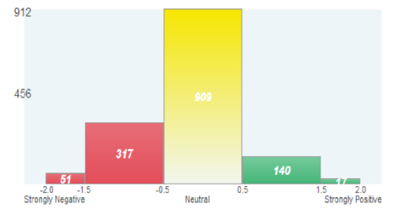

```{r setup, cache = FALSE, echo = FALSE, message = FALSE, warning = FALSE, tidy = FALSE}
require(knitr)
options(width = 100, scipen = 5)
# options(width = 100, digits = 7)
opts_chunk$set(message = FALSE, error = FALSE, warning = FALSE, 
               collapse = TRUE, tidy = FALSE,
               cache = FALSE, cache.path = '.cache/', 
               fig.align = 'left', dpi = 100, fig.path = 'figures/Tweets_to_Knowledge/')
# opts_chunk$set(dev="png", 
#                dev.args=list(type="cairo"),
#                dpi=96)
```

## PRELIMINARIES

Libraries needed for data processing and plotting:
```{r load_packages, cache = FALSE, echo = TRUE, message = FALSE, warning = FALSE, tidy = FALSE}
library("tm")
library("SnowballC")

library("caTools")
library("rpart")
library("rpart.plot")
library("randomForest")
```

```{r saved_load_libs, echo = FALSE, eval = FALSE}
# library("dplyr")
# library("magrittr")
# library("ggplot2")

# library("ROCR")
# library("caret")
# library("e1071")
```

```
# May need to execute this 
Sys.setlocale("LC_ALL", "C")
```
## INTRODUCTION


We will be trying to understand sentiment of tweets about the company Apple.

While Apple has a large number of fans, they also have a large number of people who don't like
their products.  They also have several competitors.   
To better understand public perception, Apple wants to monitor how people feel over time and how
people receive new announcements. 

Our challenge in this lecture is to see if we can correctly classify tweets as being negative,
positive, or neither about Apple.


### The Data

To collect the data needed for this task, we had to perform two steps.

#### Collect Twitter data

The first was to collect data about tweets from the internet.   
Twitter data is publicly available, and it can be collected it through scraping the website or via the Twitter API.

The __sender__ of the tweet _might be useful to predict sentiment_, but we will ignore it to keep our data anonymized.   
So we will just be using the text of the tweet.

#### Construct the outcome variable

Then we need to construct the outcome variable for these tweets, which means that we have to label
them as __positive__, __negative__, or __neutral__ sentiment.

We would like to label thousands of tweets, and we know that two people might disagree over the
correct classification of a tweet.
To do this efficiently, one option is to use the _Amazon Mechanical Turk_.

The task that we put on the _Amazon Mechanical Turk_ was to judge the sentiment expressed by the
following item toward the software company Apple.   
The items we gave them were tweets that we had collected.
The workers could pick from the following options as their response: 

* strongly negative, 
* negative,
* neutral,
* positive, and 
* strongly positive.

These outcomes were represented as a number on the scale from __-2__ to __2__.

Each tweet was labeled by five workers.
For each tweet, we take the average of the five scores given by the five workers, hence the 
final scores can range from -2 to 2 in increments of 0.2.

The following graph shows the distribution of the number of tweets classified into each of the
categories.  We can see here that the majority of tweets were classified as neutral, with a small
number classified as strongly negative or strongly positive.



So now we have a bunch of tweets that are labeled with their sentiment.
But how do we build independent variables from the text of a tweet to be used to predict the sentiment?


### A Bag of Words

One of the most used techniques to transforms text into independent variables is that called __Bag of Words__.

Fully understanding text is difficult, but _Bag of Words_ provides a very simple approach: it just
counts the number of times each word appears in the text and uses these counts as the independent
variables.

For example, in the sentence, 

    "This course is great.  I would recommend this course to my friends,"

the word __this__ is seen twice, the word __course__ is seen twice, the word __great__ is seen once, et cetera.


In _Bag of Words_, there is __one feature for each word__.
This is a very simple approach, but is often very effective, too.
It is used as a baseline in text analytics projects and for Natural Language Processing.

This is not the whole story, though.
__Preprocessing__ the text can dramatically improve the performance of the _Bag of Words_ method.


#### Cleaning Up Irregularities

One part of preprocessing the text is to clean up irregularities.   
Text data often as many inconsistencies that will cause algorithms trouble.
Computers are very literal by default.

* One common irregularity concerns the __case__ of the letters, and it is customary to change all words
to either lower-case or upper-case.

* __Punctuation__ also causes problems, and the basic approach is to remove everything that is not a letter.
However some punctuation is meaningful, and therefore the removal of punctuation should be
tailored to the specific problem.

There are also __unhelpful terms__:

* __Stopwords__: they are words used frequently but that are only meaningful in a sentence.
Examples are _the_, _is_, _at_, and _which_.
It's unlikely that these words will improve the machine learning prediction quality,
so we want to remove them to reduce the size of the data.
    * There are some potential problems with this approach.
    Sometimes, two stop words taken together have a very important meaning (_e.g._ the name of the band "The Who").
    By removing the stop words, we remove both of these words, but The Who might actually have a significant meaning 
    for our prediction task.

* __Stemming__: This step is motivated by the desire to represent words with different endings as the same word.
We probably do not need to draw a distinction between _argue_, _argued_, _argues_, and _arguing_.
They could all be represented by a common stem, _argu_.
The algorithmic process of performing this reduction is called stemming.   
There are many ways to approach the problem.

    1. One approach is to build a __database of words__ and their stems.   
        * A pro is that this approach handles exceptions very nicely, since we have defined all of the stems.
        * However, it will not handle new words at all, since they are not in the database.   
          This is especially bad for problems where we're using data from the internet, since we 
          have no idea what words will be used.

    2. A different approach is to write a __rule-based algorithm__.    
       In this approach, if a word ends in things like _ed_, _ing_, or _ly_, we would remove the ending.
        * A pro of this approach is that it handles new or unknown words well.
        * However, there are many exceptions, and this approach would miss all of these.   
          Words like _child_ and _children_ would be considered different, but it would get other plurals, 
          like dog and dogs.     

    This second approach is widely popular and is called the __Porter Stemmer__, designed by
    Martin Porter in 1980, and it's still used today.


## LOADING AND PROCESSING DATA IN R


```{r load_data}
tweets <- read.csv("data/tweets.csv", stringsAsFactors = FALSE)
```
__Note__: when working on a text analytics problem it is important (necessary!) to add the extra
argument `stringsAsFactors = FALSE`, so that the text is read in properly.

Let's take a look at the structure of our data: 

```{r check_data}
str(tweets)
```

We have __`r nrow(tweets)`__ observations of __`r ncol(tweets)`__ variables:

* __Tweet__: the text of the tweet.
* __Avg__: the average sentiment score.

The tweet texts are real tweets that gathered on the internet directed to Apple with a few cleaned up words.

We are more interested in being able to detect the tweets with __clear negative__ sentiment, so
let's define a __new variable__ in our data set called `Negative`.

* equal to TRUE if the average sentiment score is __less than or equal to -1__ 
* equal to FALSE if the average sentiment score is greater than -1.

```{r new_variable}
tweets$Negative <- as.factor(tweets$Avg <= -1)
```

```{r table_of_new_variable}
table(tweets$Negative)
```

## CREATING A CORPUS

One of fundamental concepts in text analysis, implemented in the package `tm` as well, 
is that of a __corpus__.    
A __corpus is a collection of documents__.

We will need to convert our tweets to a corpus for pre-processing. 
Various function in the `tm` package can be used to create a corpus in many different ways.    
We will create it from the `tweet` column of our data frame using two functions, `Corpus()` and `VectorSource()`.
We feed to this latter the `Tweets` _variable_ of the `tweets` _data frame_.

```{r create_corpus}
corpus <- Corpus(VectorSource(tweets$Tweet))
```

Let's take a look at corpus:
```{r check_corpus}
corpus
```

We can check that the documents match our tweets by using double brackets `[[`.   
To inspect the first (or 10th) tweet in our corpus, we select the first (or 10th) element as: 
```{r check_corpus_documents}
corpus[[1]]

corpus[[10]]
```

### Converting text to _lower case_

Pre-processing is easy in `tm`.    
Each operation, like stemming or removing stop words, can be done with one line in R, 
where we use the `tm_map()` function which takes as

* its first argument the name of a __corpus__ and 
* as second argument a __function performing the transformation__ that we want to apply to the text.

To transform all text _to lower case_:

```{r process_tolower}
corpus <- tm_map(corpus, tolower)
```

Checking the same two "documents" as before:
```{r check_corpus_after_tolower}
corpus[[1]]

corpus[[10]]
```

```{r process_to_plain_text}
corpus <- tm_map(corpus, PlainTextDocument)
```

### Removing punctuation

```{r process_remove_punctuation}
corpus <- tm_map(corpus, removePunctuation)
```

Check the first document:
```{r check_corpus_after_removing_punctuation}
corpus[[1]]

corpus[[10]]
```

### Removing _stop words_ (and _apple_)


Next we want to remove the _stop words_ in our tweets.  
It is necessary to define a list of words that we regard as being stop words, and for this
the `tm` package provides a default list for the English language.
We can check it out with:
```{r check_stopwords}
stopwords("english")[1:10]
```

Removing words can be done with the `removeWords` argument to the `tm_map()` function, with an
extra argument, _i.e._ what the stop words are that we want to remove.  

We will remove all of these English stop words, but we will also remove the word "_apple_"
since all of these tweets have the word "_apple_" and it probably won't be very useful in our
prediction problem.

```{r process_remove_stopwords}
corpus <- tm_map(corpus, removeWords, c("apple", stopwords("english")))
```

```{r check_corpus_after_removing_stopwords}
corpus[[1]]

corpus[[10]]
```

### Stemming

Lastly, we want to stem our document with the `stemDocument` argument.

```{r process_stemming}
corpus <- tm_map(corpus, stemDocument)
```

```{r check_corpus_after_stemming}
corpus[[1]]

corpus[[10]]
```

We can see that this took off the ending of "customer," "service," "received," and "appstore."


## BAG OF WORDS IN R

### Create a _Document Term Matrix_

We are now ready to extract the __word frequencies__ to be used in our prediction problem.
The `tm` package provides a function called `DocumentTermMatrix()` that generates a __matrix__ where:

* the __rows__ correspond to __documents__, in our case tweets, and 
* the __columns__ correspond to __words__ in those tweets.

The values in the matrix are the number of times that word appears in each document.

```{r create_DTM}
DTM <- DocumentTermMatrix(corpus)
```

```{r check_DRM}
DTM
```

We see that in the corpus there are __`r DTM$ncol`__ __unique words__.

Let's see what this matrix looks like using the `inspect()` function, in particular
slicing a block of rows/columns from the _Document Term Matrix_ by calling by their indices:
```{r check_frequencies}
inspect(DTM[1000:1005, 505:515])
```

In this range we see that the word "cheer" appears in the tweet 1005, but "cheap" does not appear
in any of these tweets.
This __data__ is what we call __sparse__.  This means that there are many zeros in our matrix.

We can look at what the most popular terms are, or words, with the function `findFreqTerms()`, 
selecting a minimum number of 20 occurrences over the whole corpus:
```{r frequent_terms}
frequent_ge_20 <- findFreqTerms(DTM, lowfreq = 20)

frequent_ge_20 
```
Out of the __`r DTM$ncol`__ words in our matrix, only __`r length(frequent_ge_20)`__ words
appear at least 20 times in our tweets.

This means that we probably have a lot of terms that will be pretty useless for our prediction model.
The number of terms is an issue for two main reasons:

* One is __computational__: more terms means more independent variables, which usually means it takes
longer to build our models.
* The other is that in building models the ratio of independent variables to observations will
affect how well the __model will generalize__.


### Remove sparse terms

Therefore let's remove some terms that don't appear very often. 
```{r remove_sparse_terms}
sparse_DTM <- removeSparseTerms(DTM, 0.995)
```
This function takes a second parameters, the __sparsity threshold__.
The sparsity threshold works as follows.

* If we say 0.98, this means to only keep terms that appear in 2% or more of the tweets.
* If we say 0.99, that means to only keep terms that appear in 1% or more of the tweets.
* If we say 0.995, that means to only keep terms that appear in 0.5% or more of the tweets, 
  about six or more tweets.

Let's see what the new _Document Term Matrix_ properties look like:
```{r check_after_removing_sparse_terms}
sparse_DTM
```
It only contains __`r sparse_DTM$ncol`__ unique terms, _i.e._ only about 
__`r round(100*sparse_DTM$ncol/DTM$ncol,1)`%__ of the full set.


### Convert the DTM to a data frame

Now let's convert the sparse matrix into a data frame that we will be able to use for our
predictive models.
```{r convert_DTM_to_DF}
tweetsSparse <- as.data.frame(as.matrix(sparse_DTM))
```

#### Fix variables names in the data frame

Since R struggles with variable names that start with a number, and we probably have some words
here that start with a number, we should run the `make.names()` function to make sure all of our
words are appropriate variable names.
It will convert the variable names to make sure they are all appropriate names for R before we
build our predictive models.
You should do this each time you build a data frame using text analytics.

To make all variable names _R-friendly_ use:
```{r fix_variable_names}
colnames(tweetsSparse) <- make.names(colnames(tweetsSparse))
```

### Add the _dependent_ variable

We should add back to this data frame our dependent variable to this data set.
We'll call it `tweetsSparse$Negative` and set it equal to the original `Negative` variable from
the tweets data frame.
```{r add_dependent_variable}
tweetsSparse$Negative <- tweets$Negative
```


### Split data in training/testing sets

Lastly, let's split our data into a training set and a testing set, putting __70%__ of the data in
the __training__ set.

```{r split_train_test}
set.seed(123)

split <- sample.split(tweetsSparse$Negative, SplitRatio = 0.7)

trainSparse <- subset(tweetsSparse, split == TRUE)
testSparse <- subset(tweetsSparse, split == FALSE)
```


## PREDICTING SENTIMENT

Let's first use __CART__ to build a predictive model, using the `rpart()` function to predict
`Negative` using all of the other variables as our independent variables and the data set `trainSparse`.

We'll add one more argument here, which is `method = "class"` so that the `rpart()` function knows
to build a classification model.
We keep default settings for all other parameters, in particular we are not adding anything for
`minbucket` or `cp`.
```{r model_CART}
tweetCART <- rpart(Negative ~ . , data = trainSparse, method = "class")
```

```{r model_CART-plot, fig.width = 5, fig.height = 4}
prp(tweetCART)
```
The tree says that

* if the word _"freak"_ is in the tweet, then predict `TRUE`, or __negative__ sentiment.
* If the word _"freak"_ is not in the tweet, but the word _"hate"_ is again predict `TRUE`.
* If neither of these two words are in the tweet, but the word _"wtf"_ is, also predict `TRUE`, 
or __negative__ sentiment.
* If __none of these three words__ are in the tweet, then predict `FALSE`, or __non-negative__ sentiment.

This tree makes sense intuitively since these three words are generally seen as negative words.


### Out-of-Sample performance of the model

Using the `predict()` function we compute the predictions of our model `tweetCART` on the new data
set `testSparse`.
Be careful to add the argument `type = "class"` to make sure we get class predictions.

```{r model_CART_predict_test}
predictCART <- predict(tweetCART, newdata = testSparse, type = "class")
```

And from the predictions we can compute the confusion matrix:
```{r model_CART_predict_test_confusion_matrix}
cmat_CART <- table(testSparse$Negative, predictCART)
cmat_CART 

accu_CART <- (cmat_CART[1,1] + cmat_CART[2,2])/sum(cmat_CART)
```
* Overall Accuracy = __`r round(accu_CART,4)`__    
  Sensitivity = `r cmat_CART[2,2]` / `r sum(cmat_CART[2,])` = __`r round(cmat_CART[2,2]/sum(cmat_CART[2,]),4)`__ ( = TP rate)    
  Specificity = `r cmat_CART[1,1]` / `r sum(cmat_CART[1,])` = __`r round(cmat_CART[1,1]/sum(cmat_CART[1,]),4)`__    
  FP rate = `r cmat_CART[1,2]` / `r sum(cmat_CART[1,])` = __`r round(cmat_CART[1,2]/sum(cmat_CART[1,]),4)`__

#### Comparison with the _baseline model_

Let's compare this to a simple baseline model that __always predicts non-negative__ (_i.e._ the
most common value of the dependent variable).

To compute the accuracy of the baseline model, let's make a table of just the outcome variable Negative.
```{r baseline_accuracy}
cmat_baseline <- table(testSparse$Negative)
cmat_baseline

accu_baseline <- max(cmat_baseline)/sum(cmat_baseline)
```
The accuracy of the baseline model is then __`r round(accu_baseline,4)`__.   
So the __CART model does better__ than the simple baseline model.


#### Comparison with a _Random Forest_ model

How well would a _Random Forest_ model do?

We use the `randomForest()` function to predict `Negative` again __using all of our other variables__ 
as independent variables and the data set `trainSparse`.
Again we use the default parameter settings:
```{r model_RF, cache = TRUE}
set.seed(123)
tweetRF <- randomForest(Negative ~ . , data = trainSparse)

tweetRF
```

And then compute the Out-of-Sample predictions:
```{r model_RF_predict_test}
predictRF <- predict(tweetRF, newdata = testSparse)
```
and compute the _confusion matrix_:
```{r model_RF_predict_test_confusion_matrix}
cmat_RF <- table(testSparse$Negative, predictRF)
cmat_RF 

accu_RF <- (cmat_RF[1,1] + cmat_RF[2,2])/sum(cmat_RF)
```
The overall __accuracy__ of this _Random Forest_ model is __`r round(accu_RF,4)`__     
This is a __little better than the CART model__, but due to the __interpretability of the CART model__,
this latter would probably be preferred over the random forest model.

If you were to use __cross-validation to pick__ the `cp` parameter for the _CART model_, the accuracy
would increase to about the same as the random forest model.

So by using a bag-of-words approach and these models, we can reasonably predict sentiment even
with a relatively small data set of tweets.

---

#### Comparison with _logistic regression_ model

Build the model, using all independent variables as predictors:
```{r model_logRegr, cache = TRUE}
tweetLog <- glm(Negative ~ . , data = trainSparse, family = "binomial")

# summary(tweetLog)
```

Prediction on the testing set:
```{r logRegr_predict_on_test}
tweetLog_predict_test <- predict(tweetLog, type = "response", newdata = testSparse)
```

Confusion matrix:
```{r logRegr_cmat}
cmat_logRegr <- table(testSparse$Negative, tweetLog_predict_test > 0.5)
cmat_logRegr 

accu_logRegr <- (cmat_logRegr[1,1] + cmat_logRegr[2,2])/sum(cmat_logRegr)
```

### The Perils of Over-fitting

The overall __accuracy__ of this _logistic regression_ model is __`r round(accu_logRegr,4)`__, 
which is __worse than the baseline (?!)__.    

If you were to compute the accuracy on the training set instead, you would see that the model does
really well on the training set.     
This is an example of __over-fitting__. The model fits the training set really well, but does not
perform well on the test set. 
A __logistic regression model with a large number of variables is particularly at risk for overfitting__.

---

## THE ANALYTICS EDGE

* Analytical sentiment analysis can replace more labor-intensive methods like polling.
* Text analytics can deal with the massive amounts of unstructured data being generated on the internet.
* Computers are becoming more and more capable of interacting with humans and performing human tasks.

---

